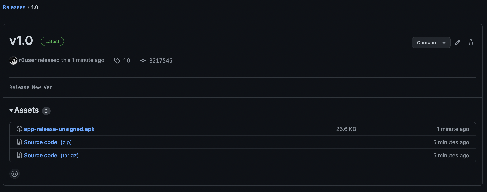

# Build & Release APK via Github Actions


## Description
🕷 Build and release APK via Github Actions when you push a new tag to your repository and it will automatically be attached to the same release.




---

## Usage
- To use this action simply create the YML file at this specified path at a root level. for example: `.github/workflows/android.yml`
- Copy paste the below YML in your YML file
- Provide the required Secrets (check below) and Environment variables (check below)
- After doing the above, whenever you are ready, make a commit from your Android Project to Github Repo
- Create and push the tag
- As soon as you push the tag this github action will be initiated and generated apk build will be released under releases with the same tag, which you can check in your github - code - releases

#### YML
```yml
name: Build & Publish Release APK

on:
  push:
    tags:
      - '*'

jobs:
  Gradle:
    runs-on: ubuntu-latest
    steps:
    - name: checkout code
      uses: actions/checkout@v2
    - name: setup jdk
      uses: actions/setup-java@v1
      with:
        java-version: 11
    - name: Make Gradle executable
      run: chmod +x ./gradlew
    - name: Build Release APK
      run: ./gradlew assembleRelease
    - name: Releasing using Hub
      uses: sangatdesai/release-apk@main
      env:
       GITHUB_TOKEN: ${{ secrets.TOKEN }}
       APP_FOLDER: app
```

## Secrets
You'll need to provide this secret token to use the action, to publish the APK to your own repo and to attach it to the created tag.
I am not sure as to why using the default `GITHUB_TOKEN` provided universally will fail to authorize the user. This is the workaround. 

* **TOKEN**: Create a new [access token](https://github.com/settings/tokens) with `repo` access
* Enter these secrets in your Android Project's Github repository's Settings > Secrets


## Environment Variables
You'll need to provide these environment variables to specify exactly what information is needed to build the APK.
* **APP_FOLDER**: main folder to search for the apk. Most of the time, it's `app`

---

## How to push a tag?

#### Git

```
Git add .
Git commit -m "new release"
git push
git tag 1.0
git push origin 1.0
```

## Flavors
By default this will create the 'release' flavor and If you want to change the flavor of the apk being built to let's say debug then change the command in your YAML

#### YML
...

    - name: Build Debug APK
      run: ./gradlew assembleDebug
      
...

### Credits
Based on [ShaunLWM](https://github.com/ShaunLWM/action-release-debugapk) & [kyze8439690](https://github.com/kyze8439690/action-release-releaseapk)

